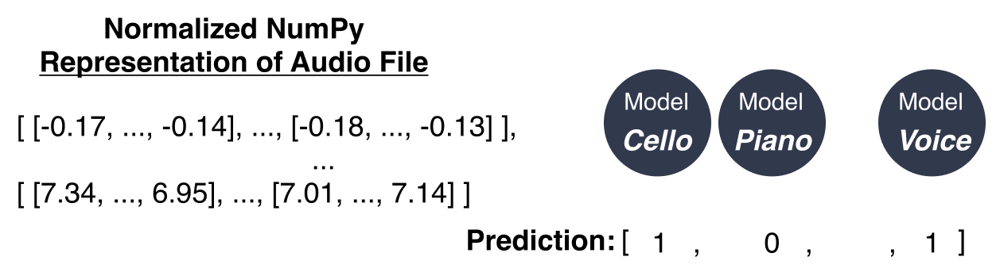

# Coda

Coda is a deep learning model which classifies the main instruments within multi-instrumental music. It was written by Lisa Li and Mengyu Yang for ECE324: Introduction to Machine Intelligence.

Our final model, the MBMLP, can be found in `multi_models.py` with the training loop located in `multi_models_main.py`

_**Figure 1:** Pipeline of our software._

_**Figure 2:** General overview of the structure of our final model, the multi-binary MLP (MBMLP). The audio file (represented as a normalized NumPy array) is the input for each of the 11 binary MLPs, who return either 1 or 0, giving a final output of an 11-element list for each of the 11 instrument classes._

_**Figure 3:** The architecture for each binary MLP from Figure 2._
