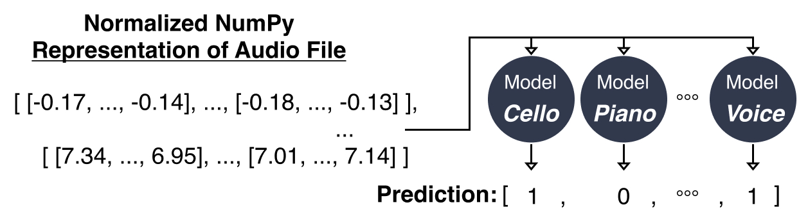

# Coda

Coda is a deep learning model which classifies the main instruments within multi-instrumental music. It was written by Lisa Li and Mengyu Yang for ECE324: Introduction to Machine Intelligence.

Our final model, the MBMLP, can be found in `multi_models.py` with the training loop located in `multi_models_main.py`.

We decided to construct a multi-binary MLP (MBMLP) system consisting of a fully-connected MLP binary classifier for each instrument class, seen in Figure 2. Developing the model consists of training 11 MLP binary classifiers. 

We implemented a coarse-to-fine hyperparameter search strategy to fine tune our model. This ultimately resulted in 4 fully connected layers starting with 5000 neurons and then going to 3000, 1000, and finally 1 neuron for the final binary output. We used a 64 batch-size, learning rate of 0.0001, and 50 epochs. BCELoss was chosen as the criterion and Adam was chosen as the optimizer. 

The resulting MBMLP is then able to predict multiple instruments. Given the same processed audio array, each individual binary classifier will make a prediction of whether its specific instrument is present or not. As a result, the output of the MBMLP model is an 11-element list which displays the predictions of each binary classifier. 

Analyzing accuracy, we see that training accuracy averages at around 77% while the validation accuracy is around 70%, with the highest value being 75.3%. Given the context of 11 instrument classes, these accuracy values are quite good, since a randomly guessing model will only achieve a 9% accuracy.

_**Figure 1:** Pipeline of our software._

_**Figure 2:** General overview of the structure of our final model, the multi-binary MLP (MBMLP). The audio file (represented as a normalized NumPy array) is the input for each of the 11 binary MLPs, who return either 1 or 0, giving a final output of an 11-element list for each of the 11 instrument classes._

_**Figure 3:** The architecture for each binary MLP from Figure 2._
